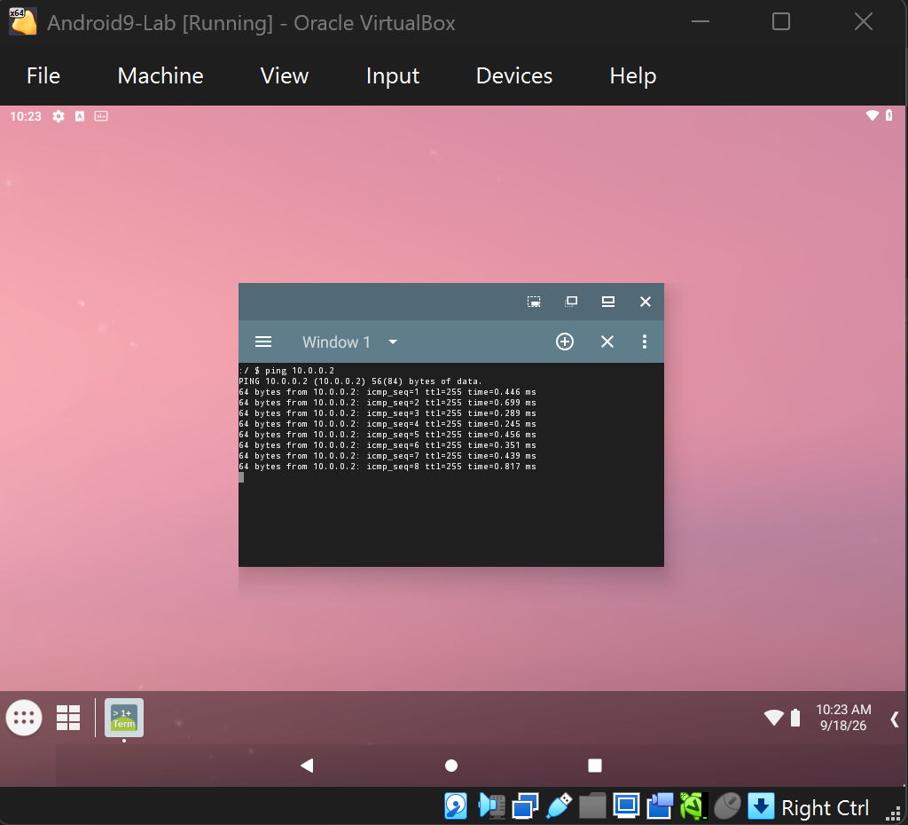
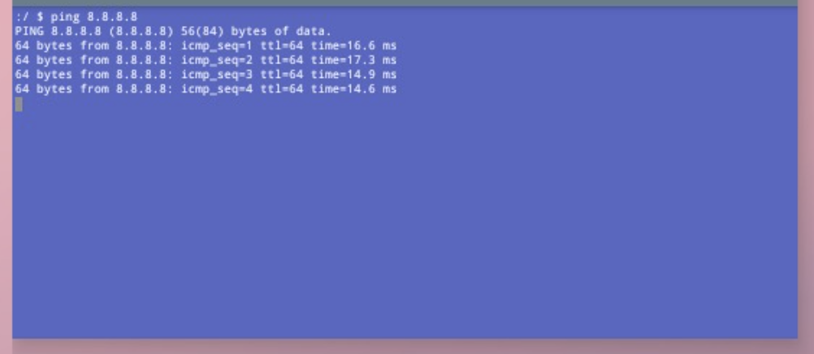
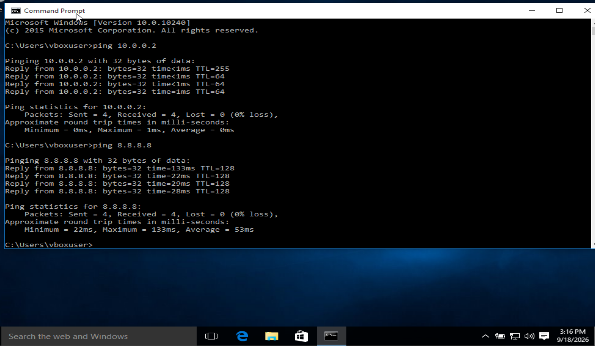
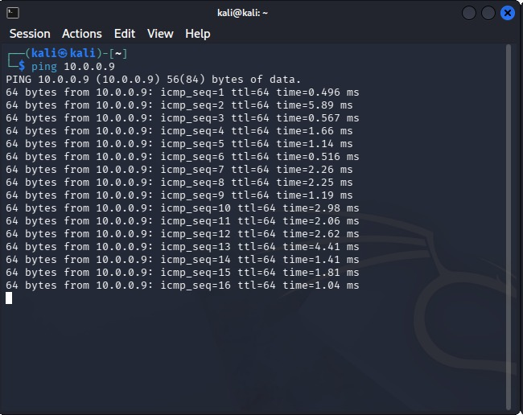
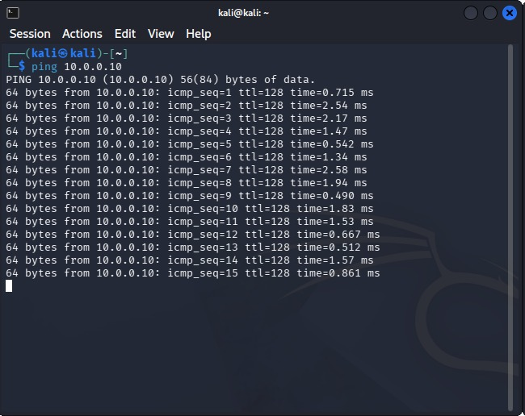

<div align="center">

# 🧪 Week 1 Extra Projects — Android-x86 & Windows 10 Lab

**Extending a Kali Linux VirtualBox lab with Android-x86 and Windows 10 VMs on a shared NAT Network**

</div>

<p align="center">
  
  
  
  
  
  
  
  
  
</p>

---

## 📌 Project Overview

This project extends the Week 1 Kali Linux VirtualBox lab by adding **two additional guest operating systems** — **Android-x86 9.0-r2** and **Windows 10 (64-bit)** — to the same **VirtualBox NAT Network**.

The goal is to build a small multi-OS virtual environment where all three machines (Kali, Android, Windows) can **reach each other** and **access the internet** through a single shared NAT gateway.

The environment is intended for **authorized security testing, cross-platform reconnaissance practice, and connectivity verification** in an isolated lab.

---

## 🎯 Objectives

- Download official Android-x86 9.0-r2 and Windows 10 ISOs.
- Create two new VirtualBox VMs with appropriate resources.
- Attach both VMs to the **same NAT Network** as Kali (`10.0.0.0/24`).
- Assign **static IPs** to each VM.
- Verify **VM-to-VM** and **VM-to-Internet** connectivity from all directions.
- Document the setup with screenshots and commands.

---

## 🛡️ Purpose of the Lab

The lab provides an isolated environment for:

- Cross-platform connectivity testing
- Reconnaissance practice against Android and Windows targets
- Firewall and service behavior comparison across OSes
- Future exploit / vulnerability lab targets

⚠️ **Important:** Only test systems you own or have **explicit written permission** to assess.

---

## 🏗️ Lab Architecture

All three VMs — **Kali Linux**, **Android9-Lab**, and **Windows10-Lab** — run under VirtualBox and are attached to the same `NatNetwork` (`10.0.0.0/24`).


```text
┌───────────────────────────────────────────────────────┐
│                  Host (Windows 11)                    │
│              VirtualBox 7.2 Hypervisor                │
│                                                       │
│   ┌───────────────────────────────────────────────┐   │
│   │         NAT Network — 10.0.0.0/24             │   │
│   │                                               │   │
│   │  ┌──────────┐  ┌──────────┐  ┌──────────┐     │   │
│   │  │   Kali   │  │ Android  │  │ Windows  │     │   │
│   │  │ 10.0.0.2 │  │ 10.0.0.9 │  │10.0.0.10 │     │   │
│   │  └────┬─────┘  └────┬─────┘  └────┬─────┘     │   │
│   │       │             │             │           │   │
│   │       └─────────────┼─────────────┘           │   │
│   │                     │                         │   │
│   │              Gateway 10.0.0.1                 │   │
│   │                     │                         │   │
│   └─────────────────────┼─────────────────────────┘   │
│                         │                             │
│                    ┌────▼─────┐                       │
│                    │ Internet │                       │
│                    └──────────┘                       │
└───────────────────────────────────────────────────────┘
```

---

## ⚙️ Lab Configuration

| 🧩 Component         | 🐉 Kali Linux        | 🤖 Android-x86       | 🪟 Windows 10         |
| -------------------- | -------------------- | -------------------- | --------------------- |
| **OS Version**       | 2026.2               | 9.0-r2 (64-bit)      | 22H2 (64-bit)         |
| **RAM**              | 2048 MB              | 2048 MB              | 4096 MB               |
| **Disk**             | 20 GB (VDI)          | 10 GB (VDI)          | 40 GB (VDI)           |
| **Network**          | NAT Network          | NAT Network          | NAT Network           |
| **IP Address**       | 10.0.0.2/24          | 10.0.0.9/24          | 10.0.0.10/24          |
| **Subnet Mask**      | 255.255.255.0        | 255.255.255.0        | 255.255.255.0         |
| **Gateway**          | 10.0.0.1             | 10.0.0.1             | 10.0.0.1              |
| **DNS**              | 8.8.8.8              | 8.8.8.8              | 8.8.8.8               |

### 🌐 Network Summary

| Setting            | Value                  |
| ------------------ | ---------------------- |
| Network type       | VirtualBox NAT Network |
| Network name       | NatNetwork             |
| Network address    | 10.0.0.0/24            |
| Gateway            | 10.0.0.1               |
| DNS                | 8.8.8.8                |

---

# 🪜 Lab Setup Procedure

## 📱 Part A — Android-x86 9.0 VM

### Step A1. Download the Android-x86 ISO

- Open the official **Android-x86** download page.
- Select the **Release 9.0** folder on the project's SourceForge page.
- Download `android-x86_64-9.0-r2.iso` (64-bit).
- Save it and note the path.

> **Tip:** Always download from **android-x86.org** or its linked SourceForge folder. Avoid third-party mirrors.

### Step A2. Create the Android VM in VirtualBox

```text
Name:     Android9-Lab
Type:     Linux
Version:  Other Linux (64-bit)
Memory:   2048 MB
Disk:     VDI, dynamically allocated, ≥ 10 GB
```

### Step A3. Attach ISO and install

- **Settings → Storage → empty disk icon** → select the Android-x86 9.0 ISO.
- **Settings → Display** → Video Memory ≥ 64 MB, enable **3D Acceleration**.
- Start VM → **Installation — Install Android-x86 to harddisk**.
- Create/modify partitions → select virtual disk → **ext4**.
- Install **GRUB**, make system **writable** (yes to both).
- Reboot when prompted.

### Step A4. Attach to NAT Network

- Shut down the VM.
- **Settings → Network** → **Attached to: NAT Network** → **Name: NatNetwork** (same as Kali).
- Start VM.

### Step A5. Set static IP inside Android

- **Settings → Network & Internet → Ethernet** (menu path varies by build).
- Turn **off DHCP** / switch to **Static IP**:

```text
IP address:   10.0.0.9
Subnet mask:  255.255.255.0
Gateway:      10.0.0.1
DNS 1:        8.8.8.8
```

### Step A6. Android connectivity tests

Inside the built-in Terminal (or a terminal emulator APK):

```bash
ping 10.0.0.2      # Kali VM
ping 8.8.8.8       # Internet
```

**Results:**

- Android → Kali (`10.0.0.2`) — replies received



- Android → Internet (`8.8.8.8`) — replies received



---

## 🪟 Part B — Windows 10 VM

### Step B1. Download the Windows 10 ISO

- Open Microsoft's official **Windows 10 download page**.
- Under **Create Windows 10 installation media**, click **Download Now**.
- Run `MediaCreationTool.exe`.
- Accept license → **Create installation media for another PC**.
- Select language, edition, **64-bit (x64)** → **ISO file** → save location.

> **Backup method (if no direct ISO option):**
> 1. Open the ISO page in Chrome/Edge.
> 2. Press **F12** → enable **Device Toolbar / Responsive Design Mode**.
> 3. Select a mobile/tablet profile → refresh.
> 4. Select edition and language → download the 64-bit ISO.

> **Tip:** Prefer Microsoft's official source. Avoid third-party ISO sites.

### Step B2. Create the Windows VM

```text
Name:     Windows10-Lab
Type:     Microsoft Windows
Version:  Windows 10 (64-bit)
Memory:   4096 MB
Disk:     VDI, dynamically allocated, ≥ 40 GB
```

### Step B3. Attach ISO and install

- **Settings → Storage** → attach the Windows 10 ISO.
- Start VM → follow setup: language → **Install Now** → skip product key → **Custom install** → select virtual disk.

### Step B4. Attach to NAT Network

- Shut down the VM.
- **Settings → Network** → **Attached to: NAT Network** → **Name: NatNetwork**.
- Start VM.

### Step B5. Set static IP inside Windows

- **Control Panel → Network and Sharing Center → Change adapter settings**.
- Right-click adapter → **Properties** → **Internet Protocol Version 4 (TCP/IPv4)** → **Properties**.
- **Use the following IP address:**

```text
IP address:       10.0.0.10
Subnet mask:      255.255.255.0
Default gateway:  10.0.0.1
Preferred DNS:    8.8.8.8
```

### Step B6. Windows connectivity tests

In **Command Prompt**:

```cmd
ping 10.0.0.2      :: Kali VM
ping 8.8.8.8       :: Internet
```

**Results:**

- Windows → Kali (`10.0.0.2`) and Windows → Internet (`8.8.8.8`) — replies received




---

## 🔎 Full Verification Matrix

| From → To               | Command                | Expected    | Screenshot |
| ----------------------- | ---------------------- | ----------- | ---------- |
| Android → Kali          | `ping 10.0.0.2`        | ✅ Replies  | `Android-Kali-Ping-Test.jpeg` |
| Android → Internet      | `ping 8.8.8.8`         | ✅ Replies  | `Android-Network-Connectivity.jpeg` |
| Kali → Android          | `ping 10.0.0.9`        | ✅ Replies  | `Kali-Android-Ping-Test.jpeg` |
| Windows → Kali          | `ping 10.0.0.2`        | ✅ Replies  | `Windows-Kali-Ping-Test.jpeg` |
| Windows → Internet      | `ping 8.8.8.8`         | ✅ Replies  | `Windows-Network-Connectivity.jpeg` |
| Kali → Windows          | `ping 10.0.0.10`       | ✅ Replies  | `Kali-Linux-Windows-Ping-Test.jpeg` |

### ✅ Confirmed Results

**Android-x86 (10.0.0.9):**
- ✅ `ping 10.0.0.2` — reaches Kali
- ✅ `ping 8.8.8.8` — reaches Internet

**Windows 10 (10.0.0.10):**
- ✅ `ping 10.0.0.2` — reaches Kali
- ✅ `ping 8.8.8.8` — reaches Internet

**Kali Linux (10.0.0.2):**
- ✅ `ping 10.0.0.9` — reaches Android



- ✅ `ping 10.0.0.10` — reaches Windows



All six connectivity paths verified successfully.

---

## 🐞 Problems Encountered & Solutions

### Problem 1 — Android-x86 ISO won't boot / hangs at GRUB

**Cause:** Video memory or 3D acceleration not enabled.

**Fix:** Settings → Display → Video Memory ≥ 64 MB → enable 3D acceleration → reboot.

### Problem 2 — Windows Media Creation Tool shows no ISO option

**Cause:** Microsoft sometimes hides the direct ISO option depending on browser/OS detection.

**Fix:** Use the **Developer Tools mobile emulation** workaround documented in Step B1 (F12 → Device Toolbar → mobile profile → refresh).

### Problem 3 — VM cannot reach others on NAT Network

**Cause:** Wrong network name, or static IP typo.

**Fix:**
1. Verify all VMs use the **same NAT Network name** (`NatNetwork`).
2. Verify subnet is `10.0.0.0/24` and all IPs are unique.
3. Verify gateway `10.0.0.1` and DNS `8.8.8.8`.

### Problem 4 — Windows ping 8.8.8.8 fails after static IP

**Cause:** Firewall profile blocking outbound, or wrong DNS.

**Fix:**
- Confirm **TCP/IPv4** settings are applied (not just typed).
- Run `ipconfig /all` to verify.
- Run `ipconfig /flushdns`.

---

## 💡 What I Learned

### 1. Extending a NAT Network Lab
Adding new VMs to the **same NAT Network** lets them talk to each other **and** the internet without reconfiguring the host — ideal for multi-target labs.

### 2. Cross-Platform Static IP Configuration
Each OS exposes networking differently:
- **Kali:** NetworkManager / `nmcli` / GUI
- **Android:** Settings → Network → Ethernet
- **Windows:** Control Panel → Adapter → TCP/IPv4

### 3. Android-x86 in VirtualBox
Android-x86 runs well in VirtualBox with 3D acceleration + 64 MB+ video memory, but is not a Google-certified Android — no Play Store by default.

### 4. Windows 10 ISO Acquisition
Microsoft's download page is inconsistent. The **Media Creation Tool** and the **mobile-emulation trick** are the reliable paths to a clean ISO.

### 5. Verification Discipline
Testing **both directions** for each pair (e.g., Kali → Android **and** Android → Kali) proves true bidirectional connectivity, not just one-way reachability.

---

## 🔐 Security & Ethical Use

This lab is intended strictly for **education and authorized security testing only**.

- Only test systems you own or have **explicit written permission** to assess.
- Do not use these tools or techniques against unauthorized systems.
- Follow all applicable laws and regulations in your jurisdiction.
- Treat this environment as a sandbox for learning — not a platform for real-world attacks.

---

## 🔗 Tools & Resources

- **VirtualBox:** [https://virtualbox.org/wiki/Downloads](https://virtualbox.org/wiki/Downloads)
- **Android-x86:** [https://www.android-x86.org/download](https://www.android-x86.org/download)
- **Android-x86 9.0-r2 on SourceForge:** [https://sourceforge.net/projects/android-x86/files/Release%209.0/](https://sourceforge.net/projects/android-x86/files/Release%209.0/)
- **Windows 10 ISO:** [https://www.microsoft.com/en-us/software-download/windows10](https://www.microsoft.com/en-us/software-download/windows10)
- **Kali Linux:** [https://kali.org/get-kali](https://kali.org/get-kali)

---

## 👤 Author

**KUGBE SAMUEL** — Cybersecurity Student, NetworkWalks

LinkedIn: **[https://www.linkedin.com/in/samuel-setonji-kugbe-416733233/?lipi=urn%3Ali%3Apage%3Ad_flagship3_feed%3BVg1DgCNXTKWgQsckJZJXiA%3D%3D]**

---

## 📌 Project Information

| Field          | Value                                                       |
| -------------- | ----------------------------------------------------------- |
| **Program**    | Cybersecurity at NetworkWalks                               |
| **Week**       | 01 — Extra Projects                                         |
| **Project**    | Android-x86 & Windows 10 VMs on a shared NAT Network        |
| **Repository** | [GitHub]https://github.com/Ksamgit/NETWORKWALKS-KUGBE-B083-WK1-PM1-CYBERSECURITY-EXTRA-PROJECTS-LAB-SETUP.git |
